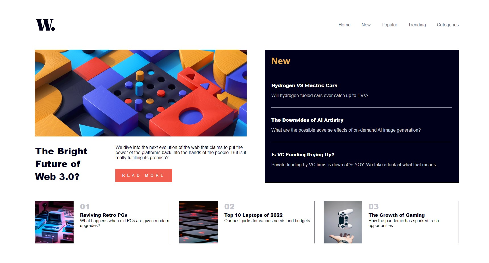
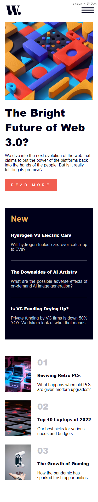

# Frontend Mentor - News homepage solution

This is a solution to the [News homepage challenge on Frontend Mentor](https://www.frontendmentor.io/challenges/news-homepage-H6SWTa1MFl). Frontend Mentor challenges help you improve your coding skills by building realistic projects.

## Table of contents

-   [Overview](#overview)
    -   [The challenge](#the-challenge)
    -   [Screenshot](#screenshot)
    -   [Links](#links)
-   [My process](#my-process)
    -   [Built with](#built-with)
    -   [What I learned](#what-i-learned)
-   [Author](#author)

## Overview

### The challenge

Users should be able to:

-   View the optimal layout for the interface depending on their device's screen size
-   See hover and focus states for all interactive elements on the page

### Screenshot




### Links

-   Solution URL: [solution on Frontend Mentor](https://www.frontendmentor.io/solutions/news-homepage-con-reactjs-scss-y-framer-motion-JmXzt_ODHn)
-   Live Site URL: [solution on web site](https://practica-newshomepage.web.app)

## My process

I've started seeing what would be the better html schema and layouts (flexbox and grid), then continue with coding the menu and finishing with the news, everything was great but then I had some problems with fonts and finally I made the animations nad re-organize the code to make it easier to read.

### Built with

-   Semantic HTML5 markup
-   [SCSS](https://sass-lang.com/guide) - style
-   Flexbox
-   CSS Grid
-   Mobile-first workflow
-   [Vite](https://vitejs.dev) - Compilation tool
-   [React](https://reactjs.org/) - JS library

### What I learned

1. I've learned to make an Animation Context to create de animations in a diferent file which will be provided to the whole page and in the same file there is a function that is pending every time the screen is resized to be able to enable/disable some animations .For Example:

```js
// AnimationsContext.jsx

export default function AnimationsContextProvider(props) {
    const [IsMobile, setIsMobile] = useState(false)
    const [windowWidth, setWindowWidth] = useState(window.innerWidth)

    useEffect(() => {
        const handleWindowResize = () => {
            setWindowWidth(window.innerWidth)
        }

        window.addEventListener('resize', handleWindowResize)

        setIsMobile(windowWidth <= 900)

        return () => {
            window.removeEventListener('resize', handleWindowResize)
        }
    })

    const enlacesMenuVariant = IsMobile
        ? {
              // initial
              closed: {
                  opacity: 0,
                  x: '100vw'
              },
              // animate
              open: {
                  opacity: 1,
                  x: 0,
                  transition: {
                      duration: 0.4
                  }
              }
          }
        : {
              closed: { opacity: 1 },
              open: { opacity: 1 }
          }

    return (
      <AnimationContext.Providervalue={{enlacesMenuVariant}}>
        {props.children}
      </AnimationContext.Providervalue>
    )
}
```

```js 
  // Menu.jsx - go to this file to see al the code, this just and "how I use this" example :)

  import { motion } from 'framer-motion'
  import { AnimationContext } from '../../context/AnimationsContext'

  const {enlacesMenuVariant} = useContext(AnimationContext)

  <motion.li
    key={link}
    variants={enlacesMenuVariant}
    whileTap={whileTapLinkVariant}
    whileHover={whileHoverLinkMenuVariant}
  >
    {link}
  </motion.li>

```

## Author

-   Frontend Mentor - [@avalonxii](https://www.frontendmentor.io/profile/avalonxii)
-   Instagram - [@avalondev_xii](https://www.instagram.com/avalondev_xii)
